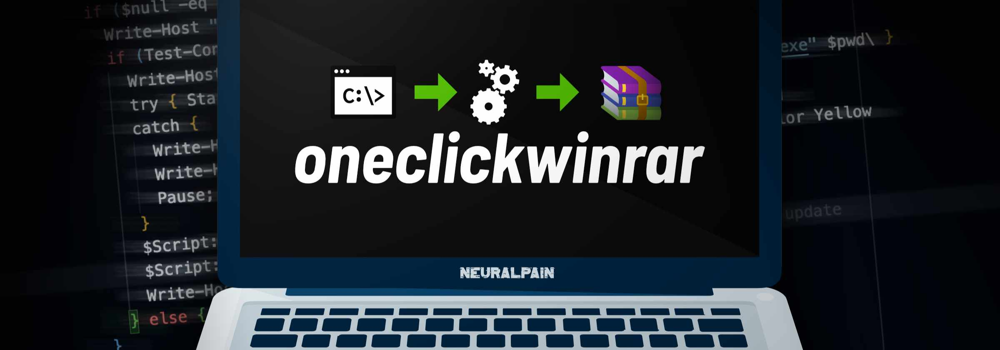

> [!TIP]
> RARLAB® released WinRAR 7.20 for public testing! Use [`installrar_720_b1`](#installrarcmd) test it out. 🚀
>
> <details>
> <summary>View changes</summary>
>
> ```
>                WinRAR - What's new in the latest version
>
>
>  Version 7.20 beta 1
>
>  1. Performance improvements when deleting files in solid RAR archives:
>
>     a) if there are no non-zero files after deleted files, archive
>        recompressing isn't performed;
>
>     b) part of archive before deleted files is copied as is, without
>        repacking. Its contents is unpacked to memory if necessary,
>        but not recompressed;
>
>     c) semi-solid archive processing involves only solid blocks containing
>        deleted files. Unaffected solid blocks are copied as is.
>
>  2. "Generate archive name by mask" archiving option and -ag command line
>      switch:
>
>     a) new 'K' format character defines the current day of week
>        name as a text string;
>
>     b) new 'O' format character defines the current month name as a text
>        string regardless of format character number. Unlike "MMM" mask,
>        it allows to use shorter or longer than 3 character names,
>        such as -agOO;
>
>     c) excessive format characters exceeding the available field width
>        are now ignored instead of appending to archive name.
>        So it is possible to use full month or week day names by providing
>        format characters in the amount equal or exceeding the longest name,
>        such as -agKKKKKKKKKK for day of week names.
>
>  3. Command line -s switch:
>
>     a) switch -s accepts the optional parameter preceded by '=' character.
>
>        Switches -s<N>, -se, -sv, -sv-, -s- are replaced by -s=<N>f, -s=e,
>        -s=v, -s=d, -s=-. Previous versions of these switches are still
>        supported in the current version, but can be removed in the future.
>
>        It is allowed to combine multiple modifiers in the same switch,
>        such as -s=e100f.
>
>     b) new switch -s=r resets the solid statistics before adding new files
>        to existing archive.
>
> ----------------------------------------------
> Read more: https://www.rarlab.com/WhatsNew.txt
>
> ```
> </details>

> [!IMPORTANT]
>
> <details>
> <summary><strong>WinRAR drops support for 32-bit Windows Operating Systems and Windows Vista</strong></summary><br/>
>
> As stated by WinRAR in the 6th entry in the `WhatsNew.txt` of version `7.10`, 32-bit operating systems are not supported anymore.
>
> ```
>   6. Windows Vista and 32-bit Windows are not supported anymore.
>      WinRAR requires Windows 7 x64 or later.
>
>      Unlike WinRAR, 32-bit self-extracting modules are still provided
>      as a part of 64-bit installation package.
> ```
>
> If you do need to install 32-bit versions of WinRAR, you can [configure installrar.cmd](#configuration) as `installrar_x32_701.cmd` to install the most recent 32-bit version of WinRAR.
> </details>

<p align="center">
  <picture></picture>
</p>

Introducing **oneclickwinrar[^1]**—a streamlined set of scripts that installs and licenses WinRAR with a single click (or double)[^2]. Perfect for quick setups, it eliminates manual steps, ensuring WinRAR is ready to use instantly. Ideal for both IT pros and everyday users.

```
there was a need for something versatile // so why not?
```

### Contents

- [What's included?](#whats-included)
    - [oneclickrar.cmd _(recommended for most users)_](#oneclickrarcmd-recommended-for-most-users)
    - [installrar.cmd](#installrarcmd)
    - [licenserar.cmd](#licenserarcmd)
    - [unlicenserar.cmd](#unlicenserarcmd)
  - [Features](#features)
    - [Script comparison table](#script-comparison-table)
  - [Benefits](#benefits)
  - [Limitations](#limitations)
- [How to use](#how-to-use)
  - [Basic usage](#basic-usage)
  - [Advanced usage](#advanced-usage)
    - [Configuration](#configuration)
    - [Naming patterns](#naming-patterns)
      - [Install and license naming pattern (supported by oneclickrar.cmd)](#install-and-license-naming-pattern-supported-by-oneclickrarcmd)
      - [Licensing-only pattern (supported by licenserar.cmd, oneclickrar.cmd)](#licensing-only-pattern-supported-by-licenserarcmd-oneclickrarcmd)
      - [Install-only pattern (supported by installrar.cmd, oneclickrar.cmd)](#install-only-pattern-supported-by-installrarcmd-oneclickrarcmd)
- [Overwriting licenses](#overwriting-licenses)
- [Download-only mode](#download-only-mode)
    - [Installing WinRAR with download-only enabled](#installing-winrar-with-download-only-enabled)
- [Extra stuff](#extra-stuff)
    - [Special function codes for `oneclickrar`](#special-function-codes-for-oneclickrar)
    - [Uninstalling WinRAR](#uninstalling-winrar)
- [License](#license)

### Development plans

<details>
<summary><i>Show completed (9)</i></summary>

- [x] License overwriting
- [x] Support for older 32-bit installers with `wrar` name
- [x] Download-only mode using a switch feature similar to overwriting
- [x] Allow script to assume 64-bit if the `architecture` is omitted when downloading a specific version of WinRAR
- [x] Allow extra functionality through substitution of the `i` in `click` with a specific number code, e.g., `onecl0ckrar.cmd`, `one-cl3ck-rar.cmd`
- [x] Allow `oneclickrar` and `unlicenserar` to uninstall WinRAR
- [x] Allow `oneclickrar` to skip installation
- [x] Allow `oneclickrar` to skip licensing
- [x] Automatically check for any WinRAR versions newer than known latest version.

</details>

### Other plans

<details>
<summary><i>Show completed (2)</i></summary>

- [x] Create a list of language codes supported by WinRAR
- [x] Place the "plans" section in a more suitable area

</details>

- [ ] Create a list of all available versions of WinRAR and the years of release

# What's included?

> [!NOTE]
> For one-time use, copy and paste the related one-line commands into a **PowerShell** terminal, respond to the necessary prompts and wait for the process to complete.
>
> For more functionality, click the highlighted names to download the script and [configure](#configuration) it.

### [oneclickrar.cmd][oneclick] _(recommended for most users)_

Download, install, update and license WinRAR, all in just one single click (or double). Yes, it's that simple.

```
irm "https://dub.sh/oneclickrar" | iex
```

```
irm "https://shorter.gg/oneclickrar" | iex   # <--- Mirror Link
```

### [installrar.cmd][install]

Stay safe and bug-free. Keep your WinRAR installation up-to-date.

```
irm "https://dub.sh/installrar" | iex
```

```
irm "https://shorter.gg/installrar" | iex   # <--- Mirror Link
```

### [licenserar.cmd][license]

Get a license to end that infinite 40-day trial period, or install a WinRAR license that you [purchased from RARLAB®][purchase].

```
irm "https://dub.sh/licenserar" | iex
```

```
irm "https://shorter.gg/licenserar" | iex   # <--- Mirror Link
```

### [unlicenserar.cmd][unlicense]

A stitch in time saves nine. Remove your WinRAR license and return to that 40-day infinite trial period.

```
irm "https://dub.sh/unlicenserar" | iex
```

```
irm "https://shorter.gg/unlicenserar" | iex   # <--- Mirror Link
```

> [!TIP]
> Get the full package from the [releases page][release]. It includes everything you need for configuration.
>
> Yes, [configuration](#configuration). Read further down past the "features" and the "how-tos" for the configuration section.
>
> For Chinese users on systems without a VPN, download [this package][ocwr_chinese] configured with the Chinese (Simplified) translation of WinRAR for 64-bit operating systems (view previous releases for 32-bit installers).

## Features

- Install and license any available version of WinRAR for both 32-bit and 64-bit architectures
- Automatically download and install the latest English WinRAR (64-bit) installer
- Optionally download a specific version of WinRAR and/or preserve the installer[^3] for future installations
- Status updates via Windows toast notifications[^4]
- Create custom licenses for your personal use[^5]
- Remove WinRAR licenses (for whatever reason)
- Uninstall WinRAR

### Script comparison table

|                   | oneclickrar | installrar | licenserar | unlicenserar |
| ----------------- | :---------: | :--------: | :--------: | :----------: |
| installation      |      ✓      |     ✓      |     ✗      |      ✗       |
| licensing         |      ✓      |     ✗      |     ✓      |      ✗       |
| check for updates |      ✓      |     ✓      |     ✗      |      ✗       |
| overwriting       |      ✓      |     ✗      |     ✓      |      ✗       |
| download-only     |      ✓      |     ✗      |     ✗      |      ✗       |
| un-licensing      |      ✓      |     ✗      |     ✗      |      ✓       |
| uninstall         |      ✓      |     ✗      |     ✗      |      ✓       |
| make you happy    |      ✓      |     ✓      |     ✓      |      ✓       |

> [!NOTE]
> `oneclickwinrar` will not overwrite existing licenses unless explicitly instructed to do so.

## Benefits

- **Convenience** – Users can quickly and easily install and license WinRAR without navigating through multiple steps or settings[^6] and enhances the overall user experience by simplifying the process, making it more user-friendly and less daunting for those who may not be comfortable with manual installations. This is particularly useful for users who may not be tech-savvy.
- **Time-Saving** – The automation reduces the time required to manually download, install, and adding license information for WinRAR. This is beneficial for both individual users and IT departments managing multiple machines.
- Standardized Mass Deployment – The automated process guarantees that WinRAR is installed and licensed in a consistent manner across multiple systems. This uniformity is crucial for scalability, making it easy to deploy the software across a large number of machines in enterprise environments where standardization is required.
- **Compliance** – Helps ensure that all installations of WinRAR are properly licensed, which is important for legal and compliance purposes.
- **Integration** – Can be integrated into larger deployment scripts or system setups, making it a seamless part of the overall software deployment process.
- **configuration** – Allows for configuration by pre-configuring download and license information via editing the script file name.

## Limitations

- No ARM support
- No MacOS support
- No Linux support
- ~~No support for 32-bit installers older than 611. These versions used a different "wrar" prefix to the version number.~~ → Added support in `v0.8.0`.

# How to use

## Basic usage

> These instructions are for the `.cmd` scripts.

1. Download the latest release of `oneclickwinrar` from the releases page
2. Optional steps:
    - Extract the contents of the zip file to a directory of your choice, if necessary
    - Add a WinRAR executable to the working directory, if necessary
    - Add a WinRAR license to the working directory, if necessary
2. Run the script

## Advanced usage

Follow steps 1-2 in basic usage, then read through the configuration section to add custom licenses, downloads and enable different features.

> [!IMPORTANT]
> Remember to extract the `bin` folder together with the script. This is necessary for generating your custom license key.

### Configuration

The aim of this method of configuration is to provide a quick and easy way for anyone to enable extra functionality in the script while preserving portability. Essentially, one would only need to configure the script once and run it anywhere without the need for extra clicks or editing.

The scripts can be configured to either add a custom license, install a specific version of WinRAR or a combination of both (with `oneclickwinrar.cmd`).

There are six (6) parameters in the configuration process:

1. `licensee` – This is "you" or whatever name you want to use
2. `license-type` – The description of license that you want to install. **This is optional.**[^7]
3. `script-name` – The name of the script file [`oneclickrar`, `licenserar`, `installrar`] that you use to install and/or license WinRAR. The script name is used for toggling switches in the script.
4. `architecture` – The architecture of the WinRAR executable (x32 or x64). The architecture can be omitted for custom download/install and will default to 64-bit.
5. `version` – The version of the WinRAR executable without any periods `"."` (eg. 590, 701). **This is optional.**
6. `tags` – These are additional tags, usually found at the end of the WinRAR executable name, used to describe the language of the executable and whether or not it is a beta release. **This is optional.**

> [!IMPORTANT]
> The `tags` are in the pattern of `<beta+lang>`. Beta tags are normally `b1`, `b2`, etc. You can check out the [language tags list][language] to see the supported languages. Look at the example below for the 32-bit Russian beta of WinRAR 6.02.
>
> ```
> oneclickrar_x32_602_b1ru.cmd
> ```
>
> If there is no beta, you can just add the language tag like this config for the Japanese 64-bit version of WinRAR 7.00.
>
> ```
> installrar_x64_700_jp.cmd
> ```

> [!WARNING]
> Do not modify the `script-name` unless you need to [overwrite licenses](#overwriting-licenses), [save download cache](#download-only-mode), or [enable a special function](#special-function-codes-for-oneclickrar).

### Naming patterns
<!-- • ⦾ ‣ ⦿ -->
> [!NOTE]
> If you do not see a `.cmd` extension in the file name, **do not add it**. This just means that you have `"Show file name extensions"` disabled in Windows Explorer. No, **you do not need to enable it**. Just continue to configure the script without adding the extension.

#### Install and license naming pattern (supported by oneclickrar.cmd)

```
[licensee]_[license-type]_<script-name>_[architecture]_[version]_[tags].cmd

Example:
  • oneclickrar_x32.cmd
  • oneclickrar_700.cmd
  • oneclickrar_x64_700.cmd
  • My Name_oneclickrar_ru.cmd
  • My Name_oneclickrar_x64_700.cmd
  • My Name_My License_oneclickrar_x32_sc.cmd
```

#### Licensing-only pattern (supported by licenserar.cmd, oneclickrar.cmd)

When setting up custom licensing, you must only add information **_BEFORE_** the `script-name`.

```
[licensee]_[license-type]_<script-name>.cmd

Example:
  • My Name_licenserar.cmd
  • Company Name_Company License Type_licenserar.cmd
```

#### Install-only pattern (supported by installrar.cmd, oneclickrar.cmd)

When setting up custom installation, you must only add information **_AFTER_** the `script-name`.

```
<script-name>_[architecture]_[version]_[tags].cmd

Example:
  • installrar_x32.cmd
  • installrar_700.cmd
  • installrar_x64_700.cmd
  • installrar_x64_700_ru.cmd
```

> [!CAUTION]
> Underscores `"_"` are primarily used for data separation and **should not** be used in license information or download data.

> [!IMPORTANT]
>
> - `installrar.cmd` is for installation only. It does not support licensing.
> - `licenserar.cmd` is for licensing only. It does not support installation.
> - Spaces are allowed within the `<licensee>` and `<license-type>` names.
> - The different data must be separated by an underscore.
> - The `<licensee>` and `<license-type>` will be displayed exactly as you type them.

> [!TIP]
> You can use as many underscores as you want to separate the data within the file name, if it helps you read it better. The example below is valid.
>
> ```
> My Name____My License__oneclickrar________x64_700_ru.cmd
> ```

# Overwriting licenses

Information pertaining to overwriting licenses is in its own section because it's a bit different (not that much different) and there are some people out there in the world who may, for one reason or another, happen to miss it.

Note: Overwriting licenses is only supported by `oneclickrar.cmd` and `licenserar.cmd`.

To enable overwriting licenses, you must edit the script's file name to have a hyphen `"-"` just before the `"rar"` so that it becomes `"-rar"`. This is a very simple switch. Errors of any nature will bring shame upon the spring-loaded keys of your 1987 IBM Model M 1391401 White Label keyboard😠.

Follow the examples below to see how it works.

```
# very simple
oneclick-rar.cmd
```

```
# so simple
Overwrite_ThisLicense_license-rar.cmd
```

```
# more practical
John Doe_Unlimited Lifetime License_oneclick-rar_x64_701.cmd
```

# Download-only mode

The functionality for saving downloads uses a similar approach to overwriting, providing a simple switch for configuration.

Note: Saving downloads is only supported by `oneclickrar.cmd`.

To enable download-only mode, you must edit the script's file name to have a hyphen `"-"` after `"one"` and before `"click"` so that it becomes `"one-click"`. This is another very simple switch. As with overwriting, errors of any nature will bring shame upon the spring-loaded _blah blah blah_. You get the point😒.

Look at the example below.

```
# very simple
one-clickrar.cmd
```

### Installing WinRAR with download-only enabled

When download-only mode is enabled, the script immediately exits upon completion of the download even if there are other configurations set for the script.

To bypass this and allow for installation while download-only is enabled, you should also switch on overwriting which will override the download-only switch to both save the installer **AND** run the installation.

```
# download-only with overwrite
one-click-rar.cmd
```

However, this move will of course overwrite the current installation of WinRAR (if any) with the custom or default settings so be sure to double-check before you run `oneclickrar`.

```
# more practical
Abigail Wilson_Pistachio License_one-click-rar_x64_624_fr.cmd
```

# Extra stuff

### Special function codes for `oneclickrar`

`oneclickrar` supports enabling special functionality within the script by replacing the `i` in `click` with one of the codes below.

- Code `0`: Uninstall WinRAR
- Code `1`: Un-license WinRAR
- Code `2`: Skip licensing and just install WinRAR
- Code `3`: Skip installation and just license WinRAR
- Code `4`: Search for WinRAR updates before installation

```
# an example showing how to rename with the code

oneclickrar.cmd
     └──────────┐
Substitute the `i` here
     ┌──────────┘
onecl█ckrar.cmd
     └─────┐
with code `3` for example
     ┌─────┘
onecl3ckrar.cmd
     └───────────── just like this.
```

### Uninstalling WinRAR

Yes, `oneclickwinrar` supports uninstalling WinRAR.

- Uninstall with `oneclickrar` with code `0`.
- Uninstall with `unlicenserar` by editing the script name to be `un-licenserar.cmd`.

<h6>

_A full configuration of oneclickrar should look incomprehensible to the average person. If your configuration looks incomprehensible, then you're an average person. Ironic, right?_

</h6>

# License

```
                                 ___                __
                                /\_ \    __        /\ \
      ___     ___      __    ___\//\ \  /\_\    ___\ \ \/'\
     / __`\ /' _ `\  /'__`\ /'___\\ \ \ \/\ \  /'___\ \ , <
    /\ \L\ \/\ \/\ \/\  __//\ \__/ \_\ \_\ \ \/\ \__/\ \ \\`\
    \ \____/\ \_\ \_\ \____\ \____\/\____\\ \_\ \____\\ \_\ \_\
     \/___/  \/_/\/_/\/____/\/____/\/____/ \/_/\/____/ \/_/\/_/
          __      __              ____    ______  ____
         /\ \  __/\ \  __        /\  _`\ /\  _  \/\  _`\
         \ \ \/\ \ \ \/\_\    ___\ \ \L\ \ \ \L\ \ \ \L\ \
          \ \ \ \ \ \ \/\ \ /' _ `\ \ ,  /\ \  __ \ \ ,  /
           \ \ \_/ \_\ \ \ \/\ \/\ \ \ \\ \\ \ \/\ \ \ \\ \
            \ `\___x___/\ \_\ \_\ \_\ \_\ \_\ \_\ \_\ \_\ \_\
             '\/__//__/  \/_/\/_/\/_/\/_/\/ /\/_/\/_/\/_/\/ /


`oneclickwinrar` is licensed under the BSD 2-Clause license.

THIS SOFTWARE IS PROVIDED BY THE COPYRIGHT HOLDERS AND CONTRIBUTORS "AS IS"
AND ANY EXPRESS OR IMPLIED WARRANTIES, INCLUDING, BUT NOT LIMITED TO, THE
IMPLIED WARRANTIES OF MERCHANTABILITY AND FITNESS FOR A PARTICULAR PURPOSE ARE
DISCLAIMED. IN NO EVENT SHALL THE COPYRIGHT HOLDER OR CONTRIBUTORS BE LIABLE
FOR ANY DIRECT, INDIRECT, INCIDENTAL, SPECIAL, EXEMPLARY, OR CONSEQUENTIAL
DAMAGES (INCLUDING, BUT NOT LIMITED TO, PROCUREMENT OF SUBSTITUTE GOODS OR
SERVICES; LOSS OF USE, DATA, OR PROFITS; OR BUSINESS INTERRUPTION) HOWEVER
CAUSED AND ON ANY THEORY OF LIABILITY, WHETHER IN CONTRACT, STRICT LIABILITY,
OR TORT (INCLUDING NEGLIGENCE OR OTHERWISE) ARISING IN ANY WAY OUT OF THE USE
OF THIS SOFTWARE, EVEN IF ADVISED OF THE POSSIBILITY OF SUCH DAMAGE.

See the LICENSE file for more information.
```

```
This project makes use of the open-source software `winrar-keygen` developed by
@BitCookies and licensed under the MIT license.

See the /bin/winrar-keygen/LICENSE file for more information.
```

[install]: https://github.com/neuralpain/oneclickwinrar/releases/latest/download/installrar.cmd
[language]: https://github.com/neuralpain/oneclickwinrar/wiki#localized-winrar-versions
[license]: https://github.com/neuralpain/oneclickwinrar/releases/latest/download/licenserar.cmd
[oneclick]: https://github.com/neuralpain/oneclickwinrar/releases/latest/download/oneclickrar.cmd
[purchase]: https://shop.win-rar.com/16/purl-shop-2183-1-n
[release]: https://github.com/neuralpain/oneclickwinrar/releases/latest
[unlicense]: https://github.com/neuralpain/oneclickwinrar/releases/latest/download/unlicenserar.cmd
[ocwr_chinese]: https://github.com/neuralpain/oneclickwinrar/releases/download/v0.11.0.711/oneclickwinrar-0.11.0.711.incl.WinRAR-x64-Chinese.zip


[^1]: The name `oneclickwinrar` refers to this project and everything that comes with it. On the other hand, `oneclickrar.cmd` (notice there's no "win" in the name) is a script within the project. Don't mix them up😑.
[^2]: On new systems without a WinRAR installation. Systems with WinRAR installed will go through some confirmations before the operation is completed.
[^3]: `oneclickwinrar` deletes download cache by default.
[^4]: Click on the notifications when they appear (with or without a visible button) for more more information.
[^5]: Please [purchase a WinRAR license][purchase] for all corporate and business use.
[^6]: Only when using the default settings without extra configuration.
[^7]: When the `license-type` is ommitted, a "Single User License" will be provided by default.

<!--
**Disclaimer:**

Please note that **oneclickwinrar** is an independent open-source project. It is **not affiliated with, endorsed by, sponsored by, or in any way associated with RARLAB or the developers of WinRAR**.

**WinRAR®** is a proprietary software product of **RARLAB**. This project, **oneclickwinrar**, is a separate tool designed to automate management of WinRAR installation and licensing.

Any use of WinRAR through **oneclickwinrar** is subject to your existing valid WinRAR license agreement with RARLAB. **oneclickwinrar** does not include or bundle a WinRAR license. Users are responsible for ensuring they have a valid WinRAR license for any features that require it.

All trademarks and registered trademarks, including **WinRAR®**, are the property of their respective owners.
-->
