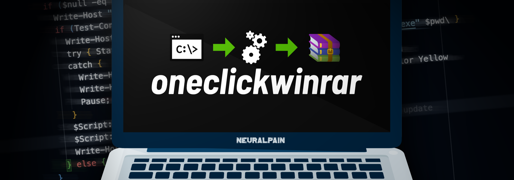

<p align="center">
  <picture></picture>
</p>

# oneclickwinrar - install and license WinRAR

```
there was a need for something versatile // so why not?
```

- `oneclickrar.cmd` - download, install/update and license WinRAR *(recommended for most users)*
- `installrar.cmd` - download and install WinRAR without licensing it (or just update if already installed)
- `licenserar.cmd` - license WinRAR, if already installed

> [!NOTE]
>
> - Will automatically download the latest English WinRAR (64-bit) installer
> - Can install and license ANY version available in the current directory
> - WinRAR is installed at `C:\Program Files\WinRAR` for 64-bit operating systems and `C:\Program Files (x86)\WinRAR` for 32-bit operating systems
> - Check the releases page for downloads (or download from the repository; whichever you prefer)

## how to use

1. Download the latest release from the releases page
2. Extract the contents of the zip file to a directory of your choice
3. Add a WinRAR executable to the directory (or update an existing one), if necessary
4. Customize and/or run the script you want to use

> [!IMPORTANT]
> Remember to extract the `bin` folder with the script files. This is necessary for generating the license key.

## customization

There are two types of customization:

  1. **Partial customization**, which is either custom licensing, or custom downloading
  2. **Complete customization**, which is both custom licensing and download

There are five (5) parts to the customization process:

- `licensee`: This is "you" or whatever name you want to use
- `license_type`: The description of license that you want to install
- `architecture`: The architecture of the WinRAR executable (eg. x64, x86)
- `version`: The version of the WinRAR executable without any periods `"."` (eg. 590, 701)
- `tags`: **This is optional.** These are additional tags, usually found at the end of the WinRAR executable name, used to describe the language of the executable and whether or not it is a beta release.

> [!WARNING]
> The `script_name` is the name of the script file [oneclickrar, licenserar, installrar] that you use to install and/or license WinRAR. Do not change the `script_name`.

## naming patterns

### complete naming pattern [oneclickrar.cmd]

```
<licensee>_<license_type>_<script_name>_<architecture>_<version>_<tags>.cmd

Example: My Name_My License_oneclickrar_x64_601.cmd
```

### licensing-only pattern [licenserar.cmd, oneclickrar.cmd]

When setting up custom licensing, you must only add information ***BEFORE*** the `script_name`.

```
<licensee>_<license_type>_<script_name>.cmd

Example: My Company_My Company License_licenserar.cmd
```

### downloading-only pattern [installrar.cmd, oneclickrar.cmd]

When setting up custom downloading, you must only add information ***AFTER*** the `script_name`.

```
<script_name>_<architecture>_<version>_<tags>.cmd

Example: installrar_x64_601.cmd
```

> [!IMPORTANT]
> * `installrar.cmd` is for installation only. It does not support custom licenses.
> * `licenserar.cmd` is for licensing only. It does not support custom downloading.
> * Spaces are allowed in the `licensee` and `license_type` names.
> * The different data must be separated by an underscore.
> * The `licensee` and `license_type` will be displayed exactly as you type them.

> [!TIP]
> You can use as many underscores as you want. The example below is valid.
> ```
> My Name____My License__oneclickrar________x64_601.cmd
> ```

# License

```
`oneclickwinrar` is licensed under the BSD 2-Clause license.

THIS SOFTWARE IS PROVIDED BY THE COPYRIGHT HOLDERS AND CONTRIBUTORS "AS IS"
AND ANY EXPRESS OR IMPLIED WARRANTIES, INCLUDING, BUT NOT LIMITED TO, THE
IMPLIED WARRANTIES OF MERCHANTABILITY AND FITNESS FOR A PARTICULAR PURPOSE ARE
DISCLAIMED. IN NO EVENT SHALL THE COPYRIGHT HOLDER OR CONTRIBUTORS BE LIABLE
FOR ANY DIRECT, INDIRECT, INCIDENTAL, SPECIAL, EXEMPLARY, OR CONSEQUENTIAL
DAMAGES (INCLUDING, BUT NOT LIMITED TO, PROCUREMENT OF SUBSTITUTE GOODS OR
SERVICES; LOSS OF USE, DATA, OR PROFITS; OR BUSINESS INTERRUPTION) HOWEVER
CAUSED AND ON ANY THEORY OF LIABILITY, WHETHER IN CONTRACT, STRICT LIABILITY,
OR TORT (INCLUDING NEGLIGENCE OR OTHERWISE) ARISING IN ANY WAY OUT OF THE USE
OF THIS SOFTWARE, EVEN IF ADVISED OF THE POSSIBILITY OF SUCH DAMAGE.

See the LICENSE file for more information.
```

```
This project makes use of the open-source software `winrar-keygen` developed by
@BitCookies and licensed under the MIT license.

THE SOFTWARE IS PROVIDED "AS IS", WITHOUT WARRANTY OF ANY KIND, EXPRESS OR
IMPLIED, INCLUDING BUT NOT LIMITED TO THE WARRANTIES OF MERCHANTABILITY,
FITNESS FOR A PARTICULAR PURPOSE AND NONINFRINGEMENT. IN NO EVENT SHALL THE
AUTHORS OR COPYRIGHT HOLDERS BE LIABLE FOR ANY CLAIM, DAMAGES OR OTHER
LIABILITY, WHETHER IN AN ACTION OF CONTRACT, TORT OR OTHERWISE, ARISING FROM,
OUT OF OR IN CONNECTION WITH THE SOFTWARE OR THE USE OR OTHER DEALINGS IN THE
SOFTWARE.

See the /bin/winrar-keygen/LICENSE file for more information.
```
